<h1 align="center">Tianhao Wang</h1>

Assistant Professor, Computer Science, University of Virginia

  
  
  
  

  Differential privacy · Private machine learning · Synthetic data · Privacy-preserving systems

I work on building privacy methods that are not only theoretically sound, but also useful in real deployments. My group focuses on differential privacy, private machine learning, synthetic data, and deployable privacy-preserving systems.

> Theory is the foundation, but deployment is the goal.

  

  

