<h1 align="center">Tianhao Wang</h1>

Assistant Professor, Computer Science, University of Virginia

  
  
  
  

  Differential privacy · Private machine learning · Synthetic data · Privacy-preserving systems

I work on building privacy methods that are not only theoretically sound, but also useful in real deployments. My group focuses on differential privacy, private machine learning, synthetic data, and deployable privacy-preserving systems.

> Theory is the foundation, but deployment is the goal.

## Research Snapshot

- Differential privacy and local differential privacy
- Private machine learning and privacy evaluation
- Synthetic data generation and measurement
- Deployable privacy-preserving systems

## Live GitHub Snapshot

  
  

## Metrics

## Fancy Dashboard

  
  

  

## Links

- [Faculty page](https://tianhao.wang)
- [Publications](https://tianhao.wang/publications/)
- [Teaching](https://tianhao.wang/teaching/)
- [Students](https://tianhao.wang/students/)
- [CV](https://tianhao.wang/files/cv.pdf)
- [UVA DP Lab](https://github.com/DPLab-UVA)

## Featured Public Work

- [LDP_Protocols](https://github.com/vvv214/LDP_Protocols): sample local differential privacy implementations
- [codex-connector](https://github.com/vvv214/codex-connector): Telegram-first local bridge for Codex
- [s25-dataprivacy](https://github.com/vvv214/s25-dataprivacy): UVA Data Privacy course materials
- [f23-cybersecprivacy](https://github.com/vvv214/f23-cybersecprivacy): Cyber Security and Privacy course materials

## Contact

Email is the best way to reach me for research discussions, collaboration, or student inquiries: [tianhao@virginia.edu](mailto:tianhao@virginia.edu)
